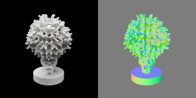

<div align="center">

# 🔄 GLB to STL Converter

[](https://www.python.org/downloads/)
[](https://opensource.org/licenses/MIT)
[](https://github.com/tom-doerr/3d_printing)
[](https://products.aspose.com/3d/)

A powerful Python tool to convert GLB files to STL format using Aspose.3D library

---

### 🎥 Input Model Preview

<p align="center">
  
</p>

<i>Above: Example GLB model from Microsoft TRELLIS that will be converted to STL format</i>

---

</div>

## ✨ Features

- 🔍 Automatically finds the newest GLB file in Downloads
- 🎯 Convert specific GLB files
- 📁 Customizable input/output directories
- 🚀 Simple command-line interface

## 🔧 Prerequisites

- Python 3.x
- Aspose.3D library

## 📦 Installation

Install the required Aspose.3D library:

```bash
pip install aspose-3d
```

## 🚀 Usage

### Basic Usage
Convert the newest GLB from Downloads:
```bash
python convert_glb_to_stl.py
```

### Advanced Options

1. **Convert Specific File:**
   ```bash
   python convert_glb_to_stl.py --input path/to/your/file.glb
   ```

2. **Custom Input Directory:**
   ```bash
   python convert_glb_to_stl.py --input-dir /path/to/directory
   ```

3. **Custom Output Directory:**
   ```bash
   python convert_glb_to_stl.py --output-dir /path/to/output
   ```

## 🎮 Command Line Arguments

| Argument | Description |
|----------|-------------|
| `--input`, `-i` | Specific GLB file to convert |
| `--input-dir` | Directory to search for GLB files (default: ~/Downloads) |
| `--output-dir`, `-o` | Output directory for STL files (default: output) |

## 📝 Example

Running without arguments will convert the most recent GLB file:

```bash
python convert_glb_to_stl.py -i ~/Downloads/model.glb -o ~/3d_prints
```

<div align="center">

---

Made with ❤️ for 3D printing enthusiasts

</div>
